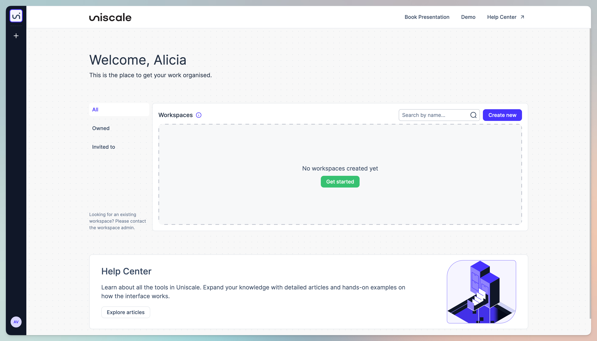

# PORTED - Quick start guide

**Welcome to Uniscale!**&#x20;

In this guide, we will show you the basics of getting started with Uniscale, from signing up to defining your project's requirements. Whether you are new to digital solutions or a seasoned developer, we got you covered. Let's dive in and get started!

## Get started



Visit [app.uniscale.com](https://app.uniscale.com/) and sign up using single sign-on (SSO) or via email.

SSO:&#x20;

<figure><figcaption>
Create account - SSO
</figcaption></figure>

Email:

<figure><figcaption>
Create account - Email
</figcaption></figure>



Upon creating your account, access your dashboard to manage account details and create a workspace.&#x20;

<figure><figcaption></figcaption></figure>

See our [Create a Workspace](ported-quick-start-guide.md#id-2.-create-your-workspace) article for more details on how to create a workspace.



## Design your solution



Within your workspace, create a solution to describe your product and outline the functional specifications.

<figure><figcaption></figcaption></figure>

Check out our article on how to[ Get started with a solution](https://help.uniscale.com/using-uniscale/specification/get-started-with-a-solution) for more details.



Clearly outline what your project needs and how it should work, providing a roadmap for development available to all stakeholders.&#x20;

Check the [Get started with a module](https://help.uniscale.com/using-uniscale/specification/get-started-with-a-module) article for more details on how to write your functional specifications

<figure><figcaption>
Write your functional specifications
</figcaption></figure>



This is where you start to document your services.&#x20;

Within the UX flows in your Solution, the process of linking your services begins by selecting "Service Flow."&#x20;

From here, navigate to the Service Linking Tab, where you can establish connections between your UX flows (integral components of your Solution) and newly developed services, thereby initiating your service journey.

<figure><figcaption>
Service Linking
</figcaption></figure>

Check out our Service Linking article for detailed guidance on how to link services.

_Tip: Consider inviting a technical expert, such as a Lead Developer or Software Architect, to guide you as you develop your services._



## Document your services



By breaking down your specifications, you can now document your services based on functional needs.&#x20;

This will give you a clear overview of what is needed from the services and enable you to quickly iterate on future versions.

<figure><figcaption>
Preview of the "Account" service in the Demo solution
</figcaption></figure>



## Generate and implement your SDK



After finishing your specification and documentation, generate the initial version of your SDK for developers to use in backend and frontend development. Read our article "[Introduction to SDK](../using-uniscale/ported-implementation/introduction-to-sdk.md)" for more details on how to do this.

<figure><figcaption>
SDK portal as seen in the Demo Solution
</figcaption></figure>




Congratulations! You have now completed the essential steps to navigate Uniscale effectively. Next, dive into the details of Specification.


\
