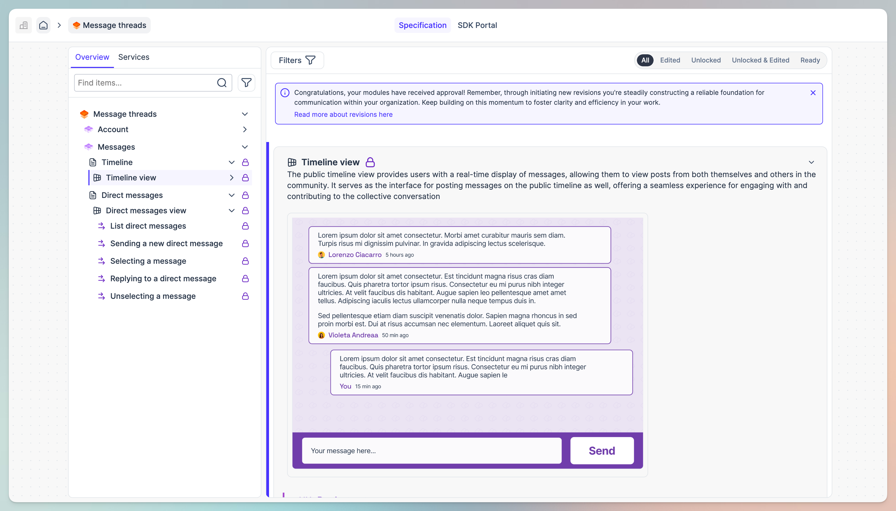

# How to replicate your project

If you have an existing project, you can replicate it in Uniscale by following the tutorial below and by using our Demo solution as an example of how to structure your solution, modules, pages and UX flows.

## 1. Create your solution

Begin by establishing your solution in Uniscale and labeling it to align with your project.

Your [solution](../using-uniscale/wip-specification/solution-basics.md#solution) can be inspired by the **`"Message Threads"`** layout found within our Demo solution, serving as the initial reference point when outlining your functional specifications. See it previewed below:&#x20;

<figure><figcaption>
A preview of the Demo solution
</figcaption></figure>

To get started, you must first create your solution

* From your Uniscale dashboard, create a new product of type solution
  * or continue with the one created when you signed up in Uniscale

<figure><figcaption>
Create solution from the dashboard overview
</figcaption></figure>

* Add the required information (title, owner and optional description)&#x20;

<figure><figcaption>
Snapshot of the create solution form
</figcaption></figure>

* With the solution created, you are now ready to replicate any content you have in your other sources (could be your Google Docs, Notion pages, Confluence, etc)


Our editors support out-of-the-box copying of text styles, so you don't have to worry about losing your text structure in terms of headers and bolded text, amongst other styles.


***

## 2. Add module to the solution

Your [modules](../using-uniscale/wip-specification/solution-basics.md#module) will contain the main "chapters" of logic in your solution. They are sets of end-user functionality that are set and changed together.

As an inspiration, they can mirror the structure of the “Messages” module in the Demo solution, effectively categorizing similar functionalities together within its scope.&#x20;

<figure><figcaption>
Modules as shown in the Demo solution
</figcaption></figure>

Initiate the create module flow either by slash or by clicking on the suggested help icons

Give your module a title and you are good to go.

***

## 3. Add pages to the module

Design your [page](../using-uniscale/wip-specification/solution-basics.md#page) to match the main structure of your project. As an inspiration, check the layout you saw in our Demo solution, called the “Timeline” page.

To add a new page, you can do so in a similar fashion to the modules, either via slash command or via inline help icons.

Initiate the create module flow either by slash or by clicking on the suggested help icons

.png>)

Now you have created a page and are ready for the next step.&#x20;

***

## 4. Add the functional use cases

Functional use cases are added to represent a user behavior inside your project. As such, you can identify them by assessing all the interactive elements.&#x20;

An example can be found in the Timeline page in the demo, where one functional use case is **`Timeline view`**

<figure><figcaption>
The "Timeline view" functional case in the Demo Solution
</figcaption></figure>

Before adding your functional use cases, best practices are to:&#x20;

A: **Identify your Use Cases** by determining the scenarios that need to be defined for your solution.

B: **Outline** each **identified functional use** case by :&#x20;

* expanding on the steps or actions involved
* create mockups or prototypes to visualize user interactions
* document specific requirements or constraints

To create a functional use case, follow the same logic as above, via the slash command or the inline helping icons

Initiate the create module flow either by slash or by clicking on the suggested help icons

.png>)

.png>)

Now you have created a functional use case and are ready for the next step.

***

## 5. Replicate your UX flows

See “List messages” as an example of the [UX flows](../using-uniscale/wip-specification/solution-basics.md#ux-flow) to be set up.

Prior to adding your UX flows, best practices are to&#x20;

A: **Define UX Flows**:

* Map out the user experience flows within your solution.
* Define the paths users will take to accomplish tasks.

B: **Write UX Product Notes**:

* Describe design decisions, user personas, and user journey maps.
* Provide context and rationale for UX choices.

C: **Add UI Notes**:

* Specify interface elements, styling, and interactions.
* Ensure consistency and usability across the solution.

Initiate the UX flows either by slash or by clicking on the suggested help icons

Give your UX flow a title and you are good to go.

***

## 6. Enrich with your acceptance criteria

Set your [acceptance criteria](../using-uniscale/wip-specification/solution-basics.md#functional-acceptance-criteria) based on those chosen for your project. You can find an example of such criteria in the Demo solution within a UX flow.

A: **Define Criteria**:

* Clearly define acceptance criteria for each module, page, or use case.
* Specify measurable conditions that must be met for the solution to be considered complete.

B: **Ensure Alignment**:

* Align acceptance criteria with project goals and stakeholder expectations.
* Review and iterate on criteria as needed to ensure clarity and effectiveness.

Add acceptance either by slash command or by clicking on the suggested help icons

.png>)

Give your Acceptance criteria a title and you are good to go.

***

## 7:  Approve your modules and solution

Repeat the above steps as much as needed to get your specification as well written as you wish.

Continuously updating the content will also add complexity to it, which we later manage with the locking cycle. Towards its end, all items should be **`"marked as ready".`**

Once everything is in place, you are now ready to create your first revision of your module.&#x20;


Congratulations! :tada: You've successfully learned how to create your solution within Uniscale and how to add modules and pages, define functional use cases, set up UX flows and UI notes, and establish acceptance criteria.&#x20;

We hope this guide helps you get started with your project effectively. If you have any further questions, don't hesitate to reach out to our support team for assistance.&#x20;

Happy building!

